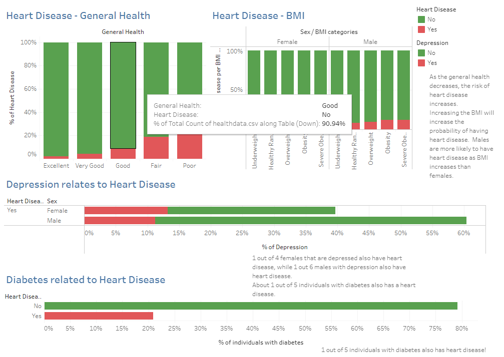
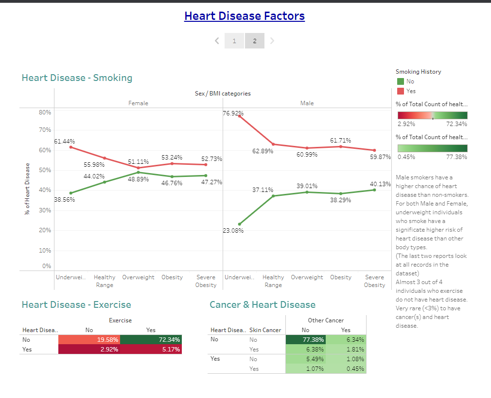

# Project 4

## Project Final Report

## Cardiovascular Disease Risk Prediction Model

### Project Overview

#### Purpose:

This project aims to create an effective machine-learning Model capable of accurately predicting heart disease in patients with or without health conditions and with different lifestyle factors.  

#### Data source:

We collected this dataset from Kaggle: 
https://www.kaggle.com/datasets/alphiree/cardiovascular-diseases-risk-prediction-dataset

### Data cleaning and Preprocessing:

The dataset that we got is already cleaned and consists of 19 variables, which are:
•	General Health 
•	Checkup
•	Exercise
•	Heart Disease
•	Skin Cancer
•	Other Cancer
•	Depression
•	Diabetes
•	Arthritis
•	Sex
•	Age category
•	Height (cm)
•	Weight (kg)
•	BMI
•	Smoking history
•	Alcohol Consumption
•	Fruit Consumption
•	Green Vegetable consumption
•	Fried Potatoes Consumption.

We imported our CSV file into Jupyter Notebook for preprocessing and did some exploratory analysis. We changed all the categorical columns, such as exercise, heart disease, skin cancer, other cancer, depression, diabetes, arthritis, and general health into numerical columns with mapping using replace (), as this is a crucial step for preparing your dataset for machine learning algorithms, which typically require numerical input. We also converted the age category column into a new age numeric column with mapping. We then dropped the height, weight, and categoric age columns and finally saved the cleaned dataset with 17 fields, inside the resource folder.

### SQL and Tableau Visualization: 

We started by creating a unique ID for each row of information. Using SQL we created two dataframes, they are:
•	Consumption DB
•	Non-Consumption DB

- Tableau Public Link: https://public.tableau.com/app/profile/brian.stumm/viz/Project4-1_17107625160390/Story1?publish=yes

1. **Dashboard 1**

   

2. **Dashboard 2**

   

We then created two CSV files, consumptiondata.csv, and healthdata.csv, and imported them into SQL Server. Now, we have created two tables, General Health and Health Consumption, and created an Entity-Relationship Diagram (ERD). ERD is a visual representation of the relationships between entities in a database.
Using Tableau, we then created interactive visualizations and dashboards that gave us insights into the relationship between features like general health, BMI, Diabetes, smoking, exercise, and cancer with heart disease. 
Some interesting observations from the dashboards are the following:

- As the general health decreases, the risk of heart disease increases.
- Increasing the BMI will increase the probability of having heart disease. Males are more likely to have heart disease as BMI increases than females. 
- 1 out of 4 females who are depressed also have heart disease, while 1 out 6 males with depression also have heart disease
- 1 out of 5 individuals with diabetes also has heart disease. 
- Male smokers have a higher chance of heart disease than female smokers. 
- The exercise report is looking at all records in the data set.  Because the data is imbalanced, the percentage of individuals with heart disease is lower than anticipated.
- The cancer report is looking at all records.  It is very rare (<3%) to have cancer(s) and heart disease.

## Machine Learning Models:

###  1.	Neural Network Model:

We created a neural network model while experimenting with different architectures, hyperparameters, and training procedures to get the best results. After the several optimizations , we only achieved an accuracy of 92.02% with  a significant amount of data loss of 0.2223. There was a slight increase in accuracy, but no significant improvement was found.

###  2.	Support Vector Machine (SVM) Model:

The model gave pretty good precisions and other metrics for the negative class/ class '0',however; failed completely to give any relevant results for the positive class/ class '1'. While SMOTE and balanced class weights are powerful tools for combating class imbalance, their effectiveness can be influenced by the quality of features, the choice of model and its complexity, and the underlying data distribution. Further explorations and adjustments in these areas might be required to achieve significant improvements.

After working with neural network and SVM model our next strategy is to try ensemble methods designed to handle imbalanced data, like Balanced Random Forest.

### 3. Random Forest Classifier Model:

- Here, we created multiple decision trees using different random subsets of the data and features to reach a more accurate prediction or result.

•	**Best Model:** We used oversampled data with the `RandomOverSampler` technique.
- 	Random oversampling involves randomly duplicating examples from the minority class and adding them to the training dataset.
- Ideal for imbalanced and skewed data.
- The model resulted in a high overall accuracy rate of 98.25% and an exceptional recall for positive hits at 100%.

### Challenges and Limitations:
- Weak to no correlation between features and target variable.
- Some Key factors missing, they are, high Blood Pressure, High Cholesterol levels, Stress, and Family history.
- Complex dataset biased towards minority classes.
- Inadequate domain knowledge.
- More binary variables than numerical variables in the dataset.

## Conclusion:

In our highly imbalanced dataset, Random Forest proved effective, achieving an impressive accuracy of 98.23% and precision scores of 1.0 and 0.97 for classes '0' (No Heart Disease) and '1' (Yes Heart Disease), respectively. This Model did an excellent job in correctly predicting the heart disease (Actual 1) 56,725 times while accurately predicting the negative cases/true negative in high numbers, i.e, 54,823 as well. The false negative and false positive is only 7 times, 1,999 times, respectively, suggesting there might still be room for fine-tuning the model to reduce these occurrences further, depending on the cost or implications of such errors in the specific application domain, which is healthcare in our case. Altogether, the extremely low False Negative rate is particularly commendable, suggesting that the model is well-suited for applications where failing to detect positive cases has serious consequences.

References:

- https://www.cdc.gov/heartdisease/risk_factors.htm

- https://towardsdatascience.com/understanding-confusion-matrix-a9ad42dcfd62

- **Project Contributors:**

- Data Preprocessing and Neural Network Model (Annie Josephrajan)
- SQL and Tableau Visualizations (Brian Stumm)
- Tableau Visualizations (Jules Gikundiro)
- Support Vector Machine Model, README & Final Report (Stuti Poudel)
- Random Forest Classifier & PowerPoint Slides (Aline Vo)

Thank you!

Authors: 

Stuti Poudel, Aline Vo, Annie Joseph Rajan, Brian Stumm, and Jules Gikundiro

